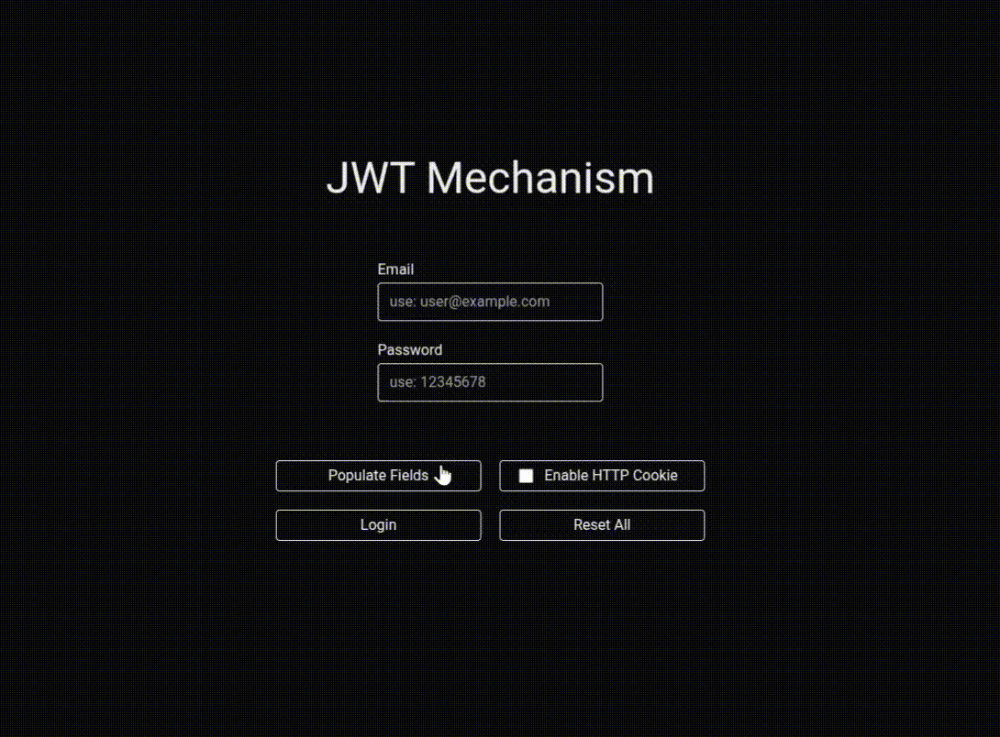

### Preview

### Why This Exists?

- This project demonstrates why storing JWT tokens outside of **HTTP-only cookies** is insecure.
- It shows how authentication becomes vulnerable to **XSS** and **XHR-based token theft** when tokens are stored in places like `localStorage` or `cookie`.
- I have intentionally added specific test buttons in the UI so users can simulate the attack scenarios and clearly understand how token leakage happens.

---

### What is JWT (JSON Web Token)?

JWT is a compact, URL-safe, **stateless** token format used to securely transmit authentication and authorization data between a client and a server, where all required user information is stored inside the token itself instead of on the server.

---

### What is XSS (Cross-Site Scripting)?

XSS is a security vulnerability where an attacker injects malicious JavaScript into a webpage. If tokens are stored in `localStorage` or `cookie`, the injected script can read and steal them.

---

### What is XHR (XMLHttpRequest)?

An XHR-based attack uses JavaScript (XMLHttpRequest or fetch) to send authenticated requests from the victim’s browser to another server, often leaking sensitive data like tokens. If a token is accessible via JavaScript, it can be extracted and sent to an attacker’s server.

---

### What is HTTP-Cookie?

An HTTP cookie is a small piece of data stored by the browser and automatically sent to the server with every request to the same domain. It is created by the server using the Set-Cookie HTTP header.

When a cookie has the HttpOnly flag:
- JavaScript cannot access it
- Protects against XSS token theft

Without HttpOnly, it becomes a normal client-accessible cookie.

---

### Conclusion

Storing JWT in `localStorage` or `cookie` is vulnerable to client-side attacks. Using HTTP-only cookies prevents JavaScript from accessing the token, significantly improving security.
